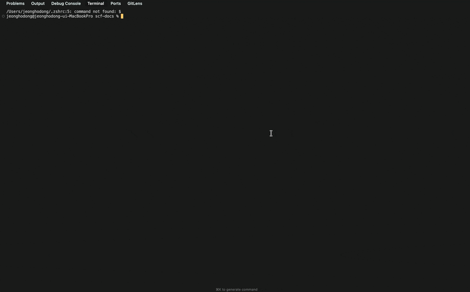

## S3 + CloudFront 배포, 여러 번은 귀찮아
---
S3와 CloudFront를 이용한 정적 웹 배포는 복잡하지 않다.
버킷 만들고, 정적 웹 호스팅 켜고, Route53 / ACM / CloudFront 연결

문제는 이걸 두 번, 세 번, 열 번 반복할 때 생긴다.

## SCF를 왜 만들었나?
---
나는 이런저런 웹서비스를 자주 만드는 편이다. 사이드 프로젝트도 있고, 간단한 랜딩 페이지도 있고, 문서 사이트도 있다. 그때마다 똑같은 과정을 반복했다. AWS 콘솔 열고, 버킷 이름 고민하고, 퍼블릭 액세스 설정하고, 정책 JSON 복붙하고, CloudFront 배포 만들고, 오리진 연결하고, 캐시 무효화 설정하고...

한 번 하면 20분이면 끝나는 일이다. 그런데 이걸 프로젝트마다 반복하다 보니 어느 순간 "또 이거 해야 하네"라는 생각이 먼저 들기 시작했다. 배포 자체보다 배포 준비가 더 귀찮아진 것이다.

매번 같은 작업인데 매번 다른 실수를 한다. 익숙해질 만하면 또 오랜만에 하게 되니까 기억이 가물가물하다.

그러다 문득 이런 생각이 들었다. 이걸 왜 자동화 안 하고 있었지?

그래서 SCF를 만들었다.
## 어떻게 동작하고 사용하나?
---
핵심은 TypeScript 설정 파일 하나로 S3 버킷 생성부터 CloudFront 배포 및 도메인 등록까지 전부 자동화하는 것이다.

사용법은 단순하다.
```
scf-deploy init
```

위 명령어로 설정 파일을 만들고, 앱 이름과 버킷 이름만 적어주면 된다. 그다음 
```
scf-deploy deploy
```
한 번이면 끝이다. 버킷이 없으면 만들고, 있으면 그대로 쓰고, CloudFront도 알아서 연결된다.

내가 가장 신경 쓴 부분은 증분 배포다. 매번 모든 파일을 업로드하는 건 비효율적이니까. SCF는 로컬 파일의 MD5 해시와 S3에 저장된 ETag 값을 비교해서 실제로 변경된 파일만 업로드한다. 파일이 100개인데 3개만 바뀌었다면, 3개만 올린다. 시간도 절약되고 비용도 줄어든다.

사실 S3와 CloudFront만 해도 귀찮은데, 추가적인 문제는 커스텀 도메인이다. 도메인 연결하려면 Route53에서 호스팅 영역 만들고, ACM에서 인증서 발급받고, DNS 검증하고, CloudFront에 연결하고... 이 과정이 S3 설정보다 더 손이 많이 간다. SCF는 이 과정 대부분을 자동화한다. 설정 파일에 도메인 이름을 적어두면, ACM 인증서 발급과 Route53 레코드 생성, CloudFront 연결까지 알아서 처리된다. 다만 도메인을 구매한 곳에서 Route53 네임서버를 등록하는 건 직접 해야 한다. 이건 도메인 업체마다 방법이 다르고, 한 번만 하면 되는 일이라 자동화 범위에서 제외했다. 네임서버 등록만 해두면 서브 도메인도 알아서 된다.

리소스 정리도 간단하다. `scf remove` 한 번이면 S3 버킷, CloudFront 배포, 관련 설정이 전부 삭제된다. 테스트용으로 만들었다가 지울 때 콘솔에서 하나하나 찾아 지우는 수고를 덜 수 있다.


## 오픈소스로 공개
---
처음 완성했을 때 바로 새 사이드 프로젝트에 적용해봤다. 예전 같았으면 "일단 개발 먼저 하고 배포는 나중에 생각하자"였을 텐데, 이번엔 달랐다. 

프로젝트 초기화하고 5분 만에 배포 환경이 갖춰졌다. 개발하면서 수시로 배포해보고, 실제 환경에서 확인하고, 다시 수정하는 흐름이 자연스러워졌다. 사소한 변화 같지만, 개발할 때의 심리적 부담이 확 줄었다. "나중에 배포할 때 또 삽질하겠지"라는 걱정 없이 제품에만 집중할 수 있게 됐다. 

그리고 이 문제가 나만 겪는 건 아닐 것 같았다. 정적 사이트를 AWS에 배포하는 사람이라면 비슷한 번거로움을 느꼈을 테니까. 그래서 오픈소스로 공개했다. 아직 완벽하진 않다. 하지만 일단 "반복되는 귀찮음"이라는 핵심 문제는 해결한 것 같다. 내 귀찮음에서 시작한 도구가 누군가에게도 도움이 되면 좋겠다.


[SCF Github Link](https://github.com/SCF-org/scf) 

[SCF Docs Link](https://docs.s3cf.net/en/)