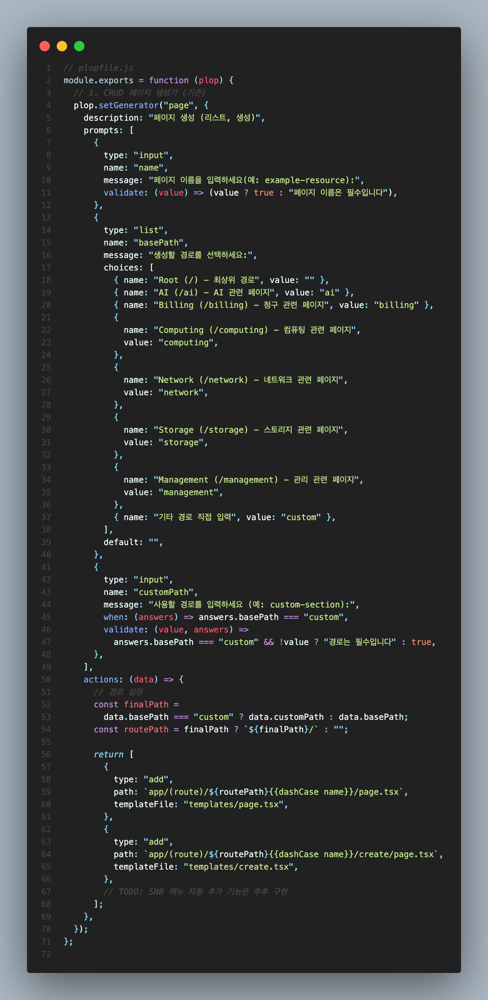

# 들어가며

---

특정 프로젝트를 개발하다 보면 비슷한 패턴의 페이지들을 반복적으로 만들게 되는 경우가 있습니다.

특히 관리자 대시보드나 SasS 플랫폼에서는 리소스 관리를 위한 CRUD(Create, Read, Update, Delete) 페이지들이 수십 개씩 필요하며 확장하는 경우가 많죠.

매번 반복되는 페이지를 만들 때마다 기존 페이지를 복사해서 수정하는 방식은 비효율적이고, 일관성도 떨어집니다.\

이런 문제를 해결하기 위해 Plop.js를 활용한 코드 생성 시스템을 구축했습니다!

#### 왜 Plop인가?

반복 작업: 비슷한 구조의 페이지를 계속 복사-붙여넣기\
일관성 부족: 개발자마자 다른 코드 스타일과 구조\
시간 낭비: 보일러 플레이트 코드를 작성하는데 소요되는 시간\
실수 발생: 수동 작업으로 인한 오타나 누락 혹은 컨벤션에 벗어남

#### Plop의 장점

빠른 생성: 몇 개의 질문만으로 완성된 페이지 생성\
일관된 구조: 미리 정의된 템플릿으로 표준화된 코드\
커스터마이징: 프로젝트에 맞는 템플릿 구조 정의\
유지보수: 템플릿 수정으로 모든 새 페이지 반영

#### 경로 관리 시스템

```
app/(route)/
├── ai/           # AI 관련 페이지
├── billing/      # 청구 관련 페이지
├── computing/    # 컴퓨팅 관련 페이지
├── network/      # 네트워크 관련 페이지
└── storage/      # 스토리지 관련 페이지
```

#### 사용법과 결과

```
# 1. 명령어 실행

npx plop page


# 2. 질문 답변

? 페이지 이름: container-registry

? 생성할 경로: Computing (/computing)


# 3. 완성!
```

#### 생성되는 결과물

```
app/(route)/computing/container-registry/
├── page.tsx
└── create/
    └── page.tsx
```
#### plop.js

# 발생했던 문제 or 실무 팁

---

#### 1. 표현식 충돌

Plop의 {{}} 구문과 JSX 객체 표현식이 충돌하여 발생한 문제가 있었습니다.

```
// 문제 상황

style={{ padding: "20px" }}


// 해결 방법

style=\{{ padding: "20px" }}
```

위와 같이 처리 혹은 기존 사용중이던 스타일링 lib styled-component로 스타일 작업을 해주어 해결해주었습니다.

#### 2. 가데이터 전략

실제 API가 준비되지 않아도 페이지가 동작하도록 하는 것이 리소스 절감 중 하나기에 가데이터를 포함했습니다.

```
// 가데이터 - 실제 API 응답으로 교체 필요

const mockResources = [

{

id: "resource-001",

name: "샘플 리소스 1",

status: "active",

// ...

}

];
```

#### 3. TODO 주석 활용

개발자가 수정해야 할 부분을 명확히 표시했습니다.

```
// TODO: 실제 API 훅으로 교체 필요

// import { useGetYourResources } from "_libs/swr/your-resources";


// TODO: 실제 경로로 변경

router.push("/your-path");
```

# 마치며

---

Plop을 활용한 보일러플레이트 시스템을 도입한 결과, 해당 개발 속도가 80% 가량 향상되었고 코드의 일관성도 높아졌습니다. 특히 새로운 팀원이 합류했을 때 빠르게 프로젝트 구조를 파악하고 기여할 수 있게 되었습니다.

단순히 코드를 생성하는 도구를 넘어서, 개발 문화와 생산성을 개선하는 시스템으로 자리잡았습니다. 여러분의 프로젝트에서도 반복적인 작업이 있다면 Plop을 활용해보시길 추천합니다!
