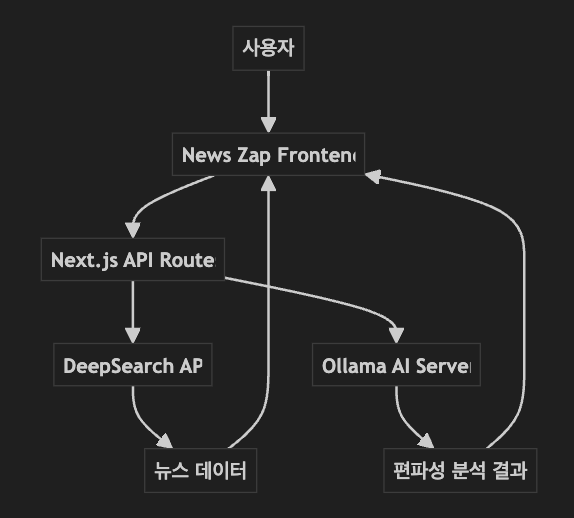
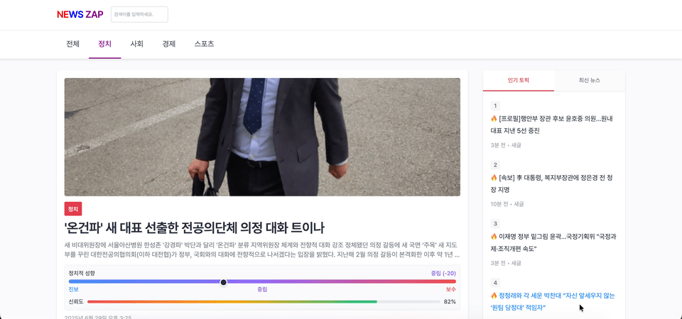
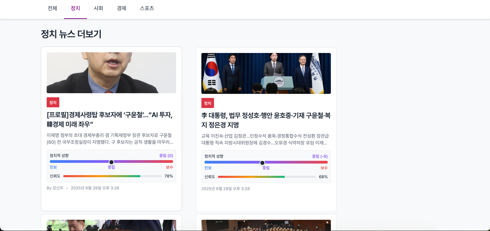
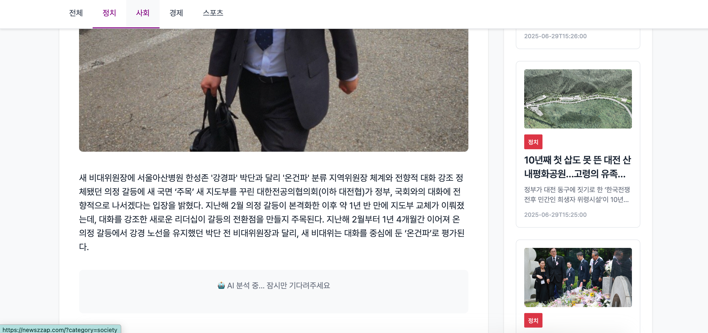
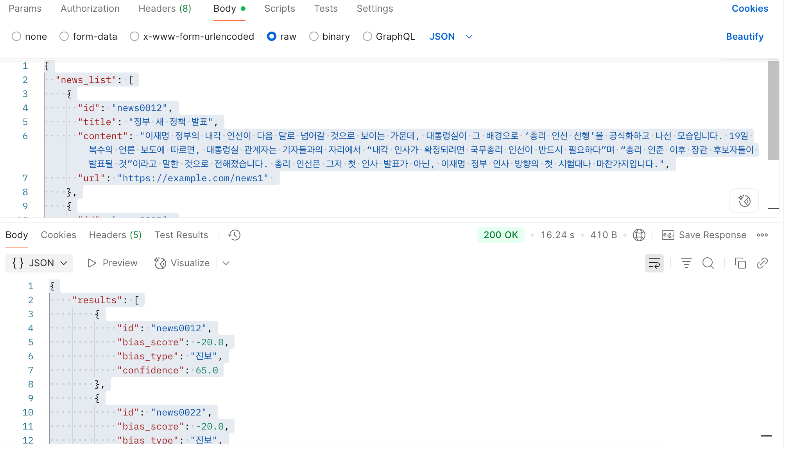

# 소개
---
현대 사회에서 뉴스 소비는 일상이 되었지만, 동시에 미디어 편파성이라는 큰 문제에 직면하고 있습니다. 같은 사건을 다루더라도 언론사마다 다른 시각으로 보도하고, 독자들은 어떤 기사가 객관적인지 판단하기 어려워합니다.

News Zap은 이런 문제를 해결하기 위해 탄생했습니다. AI 기술을 활용하여 각 기사의 정치적 편파성을 수치화하고 시각적으로 표현함으로써, 사용자가 더 현명한 판단을 내릴 수 있도록 돕는 혁신적인 뉴스 플랫폼입니다.
# 사용된 기술은?
---
#### Frontend
- Framework: Next.js 15

- Language: TypeScript

- Styling: Emotion (CSS-in-JS)

- State Management: TanStack Query (React Query)

-  HTTP Client: ky
#### Backend
- API Proxy: Next.js API Routes

- News Data: DeepSearch News API

- AI Analysis: Ollama AI Server
#### Development Environment

# 구현
---

이렇게 각 기사 별로 정치적 성향으로 정치적 편파성을 사용자에게 보여줍니다.

자세한 카드 정보입니다. 

기사 디테일 페이지 부분은 하단과 같습니다. 제목과 내용을 기반으로 Ollama AI를 배포해놓은 서버로 요청하여 AI의 분석이 시작됩니다.

이 후 하단과 같이 정보를 응답해줍니다.

# 마치며
---
미디어 편파성 문제는 하루아침에 해결될 수 없는 복잡한 사회적 이슈입니다. 하지만 기술을 통해 조금이라도 더 나은 방향으로 나아갈 수 있다면, 그것만으로도 충분한 가치가 있다고 생각합니다.

 "완벽한 객관성은 존재하지 않지만, 더 나은 균형을 위해 노력할 수는 있습니다."

앞으로도 사용자와 사회에 실질적인 도움이 되는 서비스를 만들어가는 개발자가 되겠습니다.