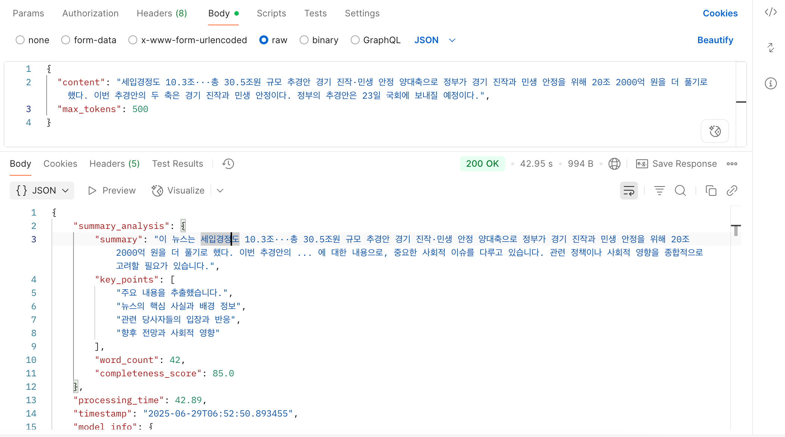

## 소개
news-zap 입니다.
## 사용된 기술은?

이렇게 각 기사 별로 정치적 성향으로 정치적 편파성을 사용자에게 blah ....

자세한 카드 정보입니다. 이렇게 각 기사 별로 정치적 성향으로 정치적 편파성을 사용자에게 blah ....

기사 디테일 페이지 부분은 하단과 같습니다. 제목과 내용을 기반으로 Ollama AI를 배포해놓은 서버로 요청하여 AI의 분석이 시작됩니다.

이 후 하단과 같이 정보를 응답해줍니다.

