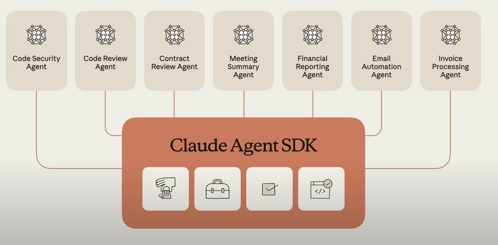

## 바이브 코딩이 아닌, 에이전틱 코딩이란?
---
어느 날 Cursor를 처음 써봤을 때의 그 충격을 아직도 기억해요.
자동완성되는 코드, 제공하는 LLM 모델을 사용하여 코드 에디터에 코드를 수정해주는 것들... 
마법을 보는 것만 같았습니다. "아 이제 개발이 이렇게 쉬워졌구나.."

그런데 얼마 지나지 않아 Claude Code를 접하게 되었습니다.
이때 느낀 점은 "아 이제 나는 어떻게 효율적으로 개발을 해야 하는 거지?????"
##### 코딩이라는 행위 자체가 변하고 있다.
---
솔직히 말하면, 처음에는 이해가 안됐습니다. Cursor로도 충분히 빠르고 작업이 편한데 왜 굳이 Claude Code를 사용해야하지? 더 복잡해 보이는데??

그런데 일주일 정도 사용해보고 깨달았습니다. 아 이건 단순히 "빠르다"의 문제가 아니구나.

## 작은 카페에서 대형 레스토랑으로 옮긴 기분
---
Cursor는 작은 동네 카페 같아요.
저는 바리스타이고, 손님이 오면 직접 주문받고, 직접 커피를 만들고, 직접 서빙합니다.
물론 레시피북(AI 자동완성)이 있어서 빠르게 만들 수 있지만, 결국 모든 과정을 제가 직접 합니다.
아늑하고 편안하죠. 모든 게 제 손 안에 있으니까요.

Claude Code는 대형 레스토랑같아요.
저는 헤드 셰프가 되는거죠. 더 이상 모든 음식을 제가 직접 만들지 않아요.
대신 주방팀에게 "오늘 메뉴는 이거고, 이런 맛을 내야 해"라고 지시합니다.
그러면 여러 팀이 동시에 움직이죠.
누군가는 전채를 만들고, 누군가는 메인을 준비하고, 누군가는 디저트를 만듭니다.

처음에는 이게 어색했습니다. "내가 직접 안 만드는데 괜찮을까?" 하는 불안감도 있었고요. 하지만 시간이 지나면서 더 중요한 일을 할 수 있게 되었다고 생각이 들더군요.

##### 대형 레스토랑, 세팅이 반이다
---
대형 레스토랑이 잘 굴러가려면 초기 세팅이 정말 중요합니다.
주방 동선을 어떻게 짤 것인가, 어떤 도구를 어디에 배치할 것인가, 각 팀이 어떻게 협업할 것인가. 이런 것들을 처음에 제대로 안 잡으면 나중에 엄청 비효율적이 됩니다.

Claude Code도 비슷한 것 같아요.
처음에 MCP 서버를 설정하고, 프로젝트 구조를 잡고, 에이전트 세팅, CLAUDE.md 세팅 등 등

근데 한 번 세팅해두면 그다음부터는 정말 강력합니다. 

##### 에이전트들과 병렬 작업이라는 마법
---
Cursor로 작업할 때는 제가
"프론트엔드 컴포넌트 만들고 → 백엔드 API 만들고 → 테스트 코드 작성하고 → 문서 업데이트"
이렇게 순차적으로 지시했어요. 하나가 끝나면 다음 걸 시작하는 거죠.

Claude Code는 다릅니다.
"프론트엔드 에이전트한테 컴포넌트 3개 만들어줘. 동시에 백엔드 에이전트에게 API도 3개 엔드포인트 필요하고, 각각에 대한 테스트도 작성해줘"라고 하면,
에이전트가 알아서 여러 파일을 동시에 수정합니다.

마치 여러 명의 개발자가 동시에 작업하는 것처럼요.
그리고 제가 할 일은 중간중간 방향을 점검하고, "이 부분은 이렇게 바꿔줘"라고 피드백 주는 거예요. 

##### MCP는 선택이 아니라 필수?
---
MCP(Model Context Protocol)가 뭔지 처음엔 잘 몰랐어요.
그냥 "플러그인 같은 거구나" 정도로만 생각했죠.

근데 써보니까 이게 게임 체인저더라고요.
MCP는 AI 에이전트가 외부 도구나 시스템과 소통할 수 있게 해주는 프로토콜입니다.
예를 들어 파일시스템 MCP를 연결하면 Claude Code가 제 프로젝트 파일을 읽고 쓸 수 있게 되고, GitHub MCP를 연결하면 이슈를 읽고 PR을 만들 수 있게 됩니다.

더 나아가서, 제가 직접 MCP를 만들 수도 있어요.
회사에서 쓰는 내부 도구가 있다면, 그걸 MCP로 만들어서 Claude Code와 연결할 수 있습니다.
그러면 Claude Code가 회사의 전체 시스템을 이해하고 작업할 수 있게 되는 거죠.

이미 커뮤니티에서 만들어진 MCP도 엄청 많습니다.
Slack, Notion, Database, Playwrite 필요한 건 찾아서 설치만 하면 됩니다.
앞으로 이런 생태계가 더 커질 거라고 생각합니다.

##### CLAUDE.md를 세팅하여 프로젝트 컨텍스트를 잡아주자
---
처음에는 Claude Code한테 매번 "이 프로젝트는 Next.js로 만들어진 거고, TypeScript 쓰고 있고, 컴포넌트는 여기 있고..."라고 설명해줘야 했어요. 정말 귀찮더라고요.

CLAUDE.md라는 걸 사용하면 해결되는 문제였습니다.
프로젝트 루트에 이 파일을 만들어두면, Claude Code가 자동으로 읽고 프로젝트의 전체 맥락을 이해합니다.

## 학습 곡선은 확실히 있다
---
솔직히 말하면 Claude Code를 처음 시작하는 게 쉽지는 않습니다.
Cursor는 정말 직관적이에요. 설치하고 바로 쓸 수 있거든요.

근데 Claude Code는 좀 다릅니다.
위 내용들에 맞게 혹은 이상을 어느정도 세팅을 해줘야 빛을 내죠.

처음 일주일은 솔직히 좀 답답했어요.
"이게 정말 더 빠른 건가?" 싶었고요.

하지만 기본 MCP 몇 개를 설치하고, 간단한 작업부터 시작하니까 점점 손에 익더라고요.

특히 도움이 됐던 건 공식 문서를 차근차근 읽는 거였어요.
유튜브 튜토리얼도 몇 개 봤고요.
그리고 확실한 것은 작은 사이드 프로젝트 하나를 Claude Code로만 만들어보면서 감을 익혔습니다.

## 마치며
---
결국 Cursor와 Claude Code 중 뭐가 더 좋냐는 질문은 좀 이상한 것 같아요.
둘 다 훌륭한 도구고, 목적이 다르니까요.

빠르게 코드를 수정하고, 직관적으로 작업하고 싶으면 Cursor가 좋습니다.
저도 아직 가끔 Cursor를 써요. 간단한 버그 픽스나 간단한 리팩토링할 때는 Cursor가 더 빠르거든요.

하지만 복잡한 기능을 만들거나, 여러 파일을 동시에 건드려야 하거나, 외부 시스템과 연동이 필요할 때는 Claude Code가 압도적입니다. 제가 설계하고 지시하면, 에이전트가 알아서 척척 만들어주는 그 느낌. 정말 미래를 경험하는 것 같아요.

결국엔 두 가지 방식을 다 사용하며 작업 중입니다. 주 작업 방식은 에이전틱 코딩이죠. 나중에는 또 에이전틱 코딩이라는 단어도 생소해지는 날이 올 것 같아요 그 만큼 AI 기술의 변화 속도가 빠르네요.

앞으로 개발자의 역할은 점점 더 "관리자"나 "설계자"에 가까워질 것 같습니다. 
직접 타이핑하는 시간은 줄고, 대신 시스템을 이해하고 방향을 제시하는 시간이 늘어나겠죠.
