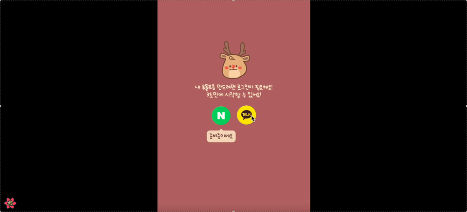
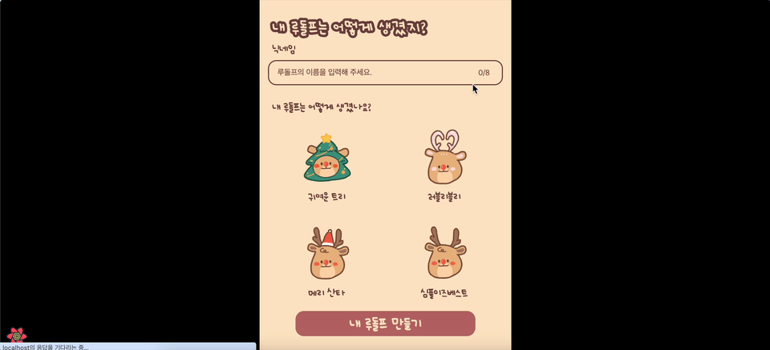
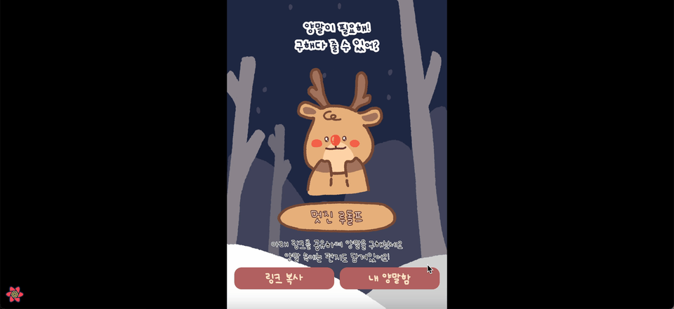

## 소개
크리스마스 기념으로 디자이너 1명과 개발자 2명에서 만든 '루돌프의 수족냉증을 막아줘' 프로젝트를 소개할게요.

마케팅은 링크 공유를 통한 바이럴 마케팅 형식으로 진행합니다.

## 사용된 기술은?

- AWS (EC2, Route53, S3 / CF)
- Nextjs / taillwindCSS
- Nestjs
- Mysql

초반 나의 루돌프를 생성하기 위해 카카오톡 소셜 로그인을 진행합니다.

이 후 나만의 루돌프를 생성하게 돼요.

나의 루돌프가 생성되고 나면 링크 복사가 생깁니다. 해당 링크를 고객들에게 공유하여 저의 루돌프에게 양말(편지)을 선물 할 수 있어요.

문제의 시작점은문제의 시작점은문제의 시작점은문제의 시작점은문제의 시작점은문제의 시작점은 입니다.

이렇게 해결하였습니다.이렇게 해결하였습니다.이렇게 해결하였습니다.이렇게 해결하였습니다.이렇게 해결하였습니다.

아아아

